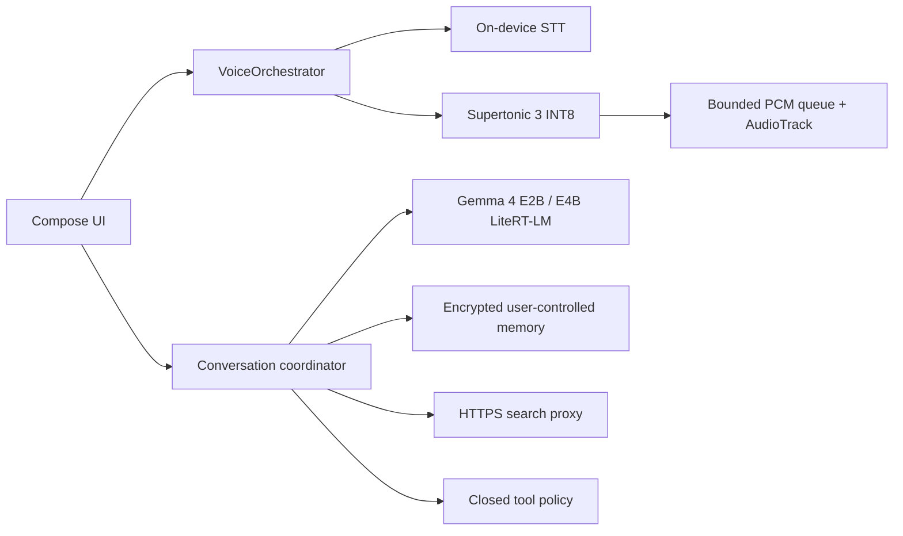

# Architecture

## Product boundary

The app is an offline-first Android client. UI, chat state, model-pack lifecycle, STT, LLM, TTS, PCM playback, search, and tool policy are separate interfaces so deterministic fakes can exercise the whole journey on an AVD.

## Voice invariant

Only one `TurnId` owns future text and audio. The UI's large voice control explicitly moves through listening, preparing, and speaking states. A press while speaking enters a serialized `HalfDuplexGate`: it cancels LLM work and synthesis, awaits the old `AudioTrack` pause/flush/release, and only then starts recognition. The playback generation gate rejects writes from older generations. Microphone capture and playback may not overlap in the first release.

## Runtime strategy

- LLM: Gemma 4 E2B targeted 2/4/8-bit is the minimum quality tier and default. Gemma 4 E4B targeted mixed quantization is the optional high-quality tier for capable devices. Both are lazily prepared off the main thread. A LiteRT `Conversation` is retained across compatible turns so its KV cache is reused; transcript divergence, model changes and explicit memory edits rebuild the context. Static execution memory, storage, first-token latency, and sustained generation speed are reported separately. Smaller language models are outside the product boundary.
- STT: API 31+ `createOnDeviceSpeechRecognizer()` only after availability checks. Never silently fall back to a network recognizer. A downloadable embedded Korean STT adapter is the future compatibility fallback.
- TTS: Supertonic 3 INT8 through sherpa-onnx on a bounded worker. Sentence chunks are normalized for Korean speech and written to an owned AudioTrack generation.
- Search: the APK calls one fixed HTTPS proxy. The proxy owns provider keys and returns bounded title/host/date/snippet evidence. The app buffers the answer, selects one representative evidence result, and renders one clickable HTTPS source link below the answer. That link is preserved with the encrypted chat record. Search summarization receives no action tools.
- Memory: only explicit remember/forget commands write to an Android Keystore AES-256-GCM store. A bounded Korean lexical retriever injects the single best-matching user fact into the current local turn; web evidence is never persisted as personal memory. Destructive forget commands are exact-match only and advance a persisted inference-history boundary so deleted facts cannot be reintroduced from older visible chat.
- Tools: a small typed allowlist. External actions are proposals rendered by deterministic Korean confirmation UI; the model cannot approve or execute them.

## Monetization boundary

The free tier retains offline chat, voice, history, and settings. `내새끼 플러스` may add more search quota, cloud-routed higher-quality answers, and later family features. Billing, entitlements, quotas, provider routing, and secrets live server-side. The current app shows preview UI only and labels its price as planned.
